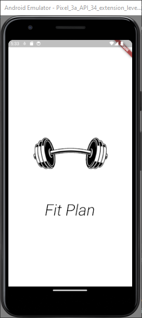
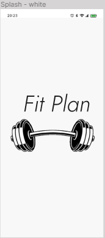
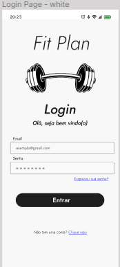
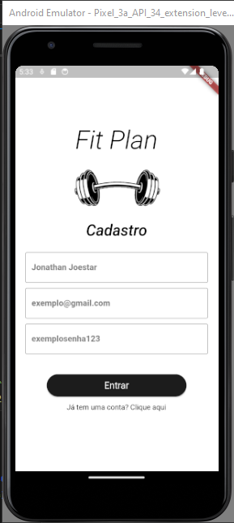
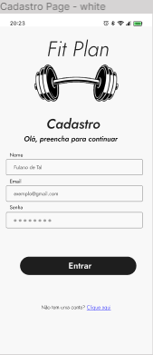
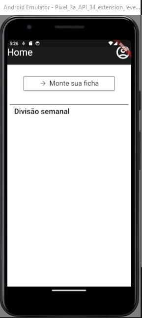

## Protótipos de Telas

Nesse arquivo apresento os protótipos de telas da aplicação, sendo um exemplo o modelo no Figma e o outro no código.

## Tela de Splash

 

## Tela de Login

 

## Tela de Cadastro

 

## Tela Inicial (Home)

 
   

## Continuação do Projeto

A continuação desse projeto será realizada em: [Link para outro repositório](https://github.com/PRoberto04/projDevMob)
